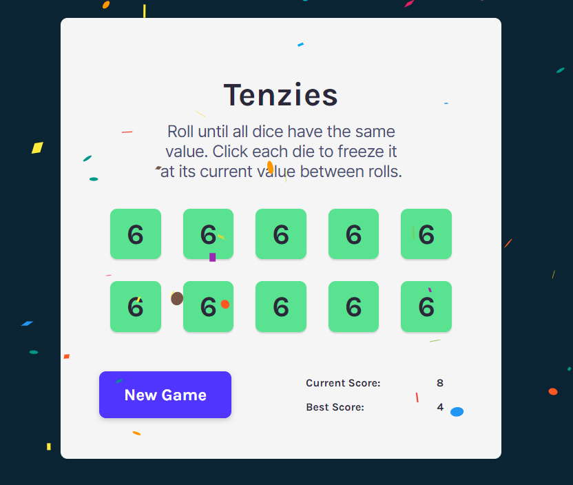

# Tenzies

This is a children's dice game which involves rolling dice until all numbers shown on the board are the same. Tap to freeze the dice and place and try to get the lowest score possible!

Tech used: 
- React
    * Conditional rendering
    * Using and setting state
    * Using props
    * Side effects
- CSS
- Accessing local storage
- [React Confetti](https://github.com/alampros/react-confetti)

